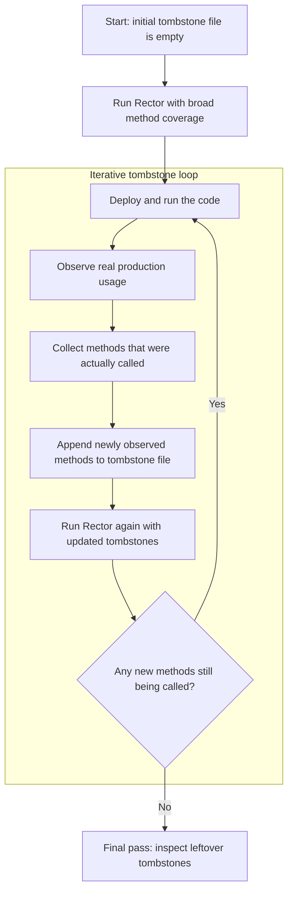

Tombstoning is an iterative method for discovering which parts of your codebase are still active in production. 
You begin with tombstones all around, instrument the code, observe real usage, and then record the methods that are actually called. 
Each Rector pass uses the growing tombstone list to avoid reprocessing known live methods. 
After several iterations, the remaining tombstones highlight code that was never observed in use, making it easier to identify dead or obsolete methods.

In this example rule, `file_put_contents` is used to record method calls.
On subsequent runs, we merge the results from previous iterations with the latest output so tombstones are not added for methods we already know are active.
After a few iterations, only code that has never been reached will receive a tombstone and can be treated as a candidate for removal.
```PHP
<?php

namespace RectorRules;

use PhpParser\Comment\Doc;
use PhpParser\Node;
use PhpParser\Node\Expr\FuncCall;
use PhpParser\Node\Name;
use PhpParser\Node\Scalar\String_;
use PhpParser\Node\Stmt\ClassMethod;
use PhpParser\Node\Stmt\Expression;
use Rector\Contract\Rector\ConfigurableRectorInterface;
use Rector\Rector\AbstractRector;
use RectorAop\hasArrayConfiguration;
use RectorAop\Pointcut\CanConfigurePointcuts;
use RectorAop\Pointcut\CanMatchPointcut;

class AddTombstones extends AbstractRector implements ConfigurableRectorInterface
{
    use CanConfigurePointcuts;
    use CanMatchPointcut;
    use hasArrayConfiguration;

    public function getNodeTypes(): array
    {
        return [ClassMethod::class];
    }

    public function refactor(Node $node)
    {
        if (! $node instanceof ClassMethod) {
            return null;
        }

        $methodName = $this->getName($node->name);
        if ($methodName === null) {
            return null;
        }

        $tombstoneStatement = new Expression(
            new FuncCall(
                new Name('file_put_contents'),
                [
                    $this->nodeFactory->createArg(new String_('tombstones')),
                    $this->nodeFactory->createArg(new String_($node->name->toString() . PHP_EOL)),
                    $this->nodeFactory->createArg(new Node\Expr\ConstFetch(new Name('FILE_APPEND'))),
                ]
            )
        );

        if ($node->stmts === null) {
            $node->stmts = [];
        }

        array_unshift($node->stmts, $tombstoneStatement);
        
        $existing = $node->getDocComment();
        $newDoc = "Here lies $methodName - last seen on the call stack, never invited back.";
        if ($existing !== null) {
            $newDoc = $existing->getText() . "\n" . $newDoc;
        }
        $node->setDocComment(new Doc($newDoc));

        return $node;
    }
}
```

```PHP
$tombstones = array_map(
    static fn (string $line) => new NotPointcut(new MethodNamePointcut(trim($line))),
    file('tombstones', FILE_IGNORE_NEW_LINES)
);

return RectorConfig::configure()
    ->withPaths([
        __DIR__ . '/app/',
    ])
    ->withRules([
        AddTombstones::class,
    ])
    ->withConfiguredRule(AddTombstones::class, [
        'pointcuts' => $tombstones,
    ]);
```

